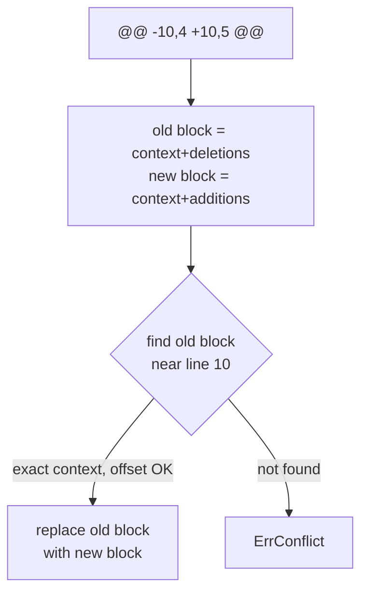
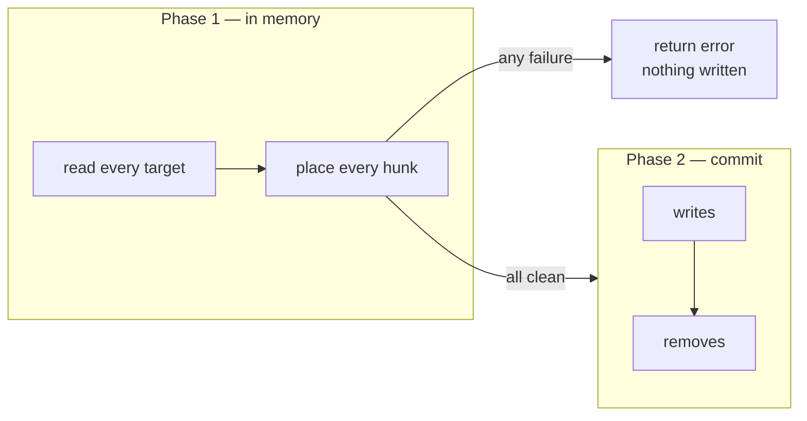

# Applying Patches

## How a hunk is placed

A hunk records the line it expects to start at and the surrounding context.
patchapply builds two blocks from the hunk — the lines it expects to find
(context + deletions) and the lines it writes (context + additions) — then
locates the old block in the file.



- **Offset is tolerated.** The search starts at the recorded line and expands
  outward, so a patch still applies when earlier edits moved the target up or
  down.
- **Context is exact.** The surrounding lines must match byte-for-byte. There
  is no fuzz factor that drops context to force a match — if the context
  changed, you get `ErrConflict`, not a misapplied hunk.
- **Hunks apply in order**, each after the previous one's position, so a file
  with several hunks can't have them cross.

## Change types

The action comes from `FileChange.Type` (set by go-mailpatch):

| Type | What patchapply does | Status |
|------|----------------------|--------|
| `Added` | write `NewPath` (errors if it exists) | `Created` |
| `Modified` | read, apply hunks, write back | `Updated` |
| `Deleted` | remove `OldPath` (errors if absent) | `Removed` |
| `Renamed` | apply hunks, write `NewPath`, remove `OldPath` | `Renamed` |
| `Copied` | apply hunks, write `NewPath`, keep `OldPath` | `Created` |

## Transactional application



Phase 1 reads each file and computes its new contents entirely in memory. Only
if **every** file and **every** hunk succeeds does phase 2 write — writes
first, then removals, so a rename's destination exists before its source is
deleted. A conflict in the last file leaves the first untouched.

## Filesystem-free: ApplyToBytes

When you already hold the content, skip the `FS` entirely:

```go
newContent, err := patchapply.ApplyToBytes(oldContent, fileChange)
if errors.Is(err, patchapply.ErrConflict) {
	// this file's hunks don't fit oldContent
}
```

`ApplyToBytes` is the core every other entry point is built on.
