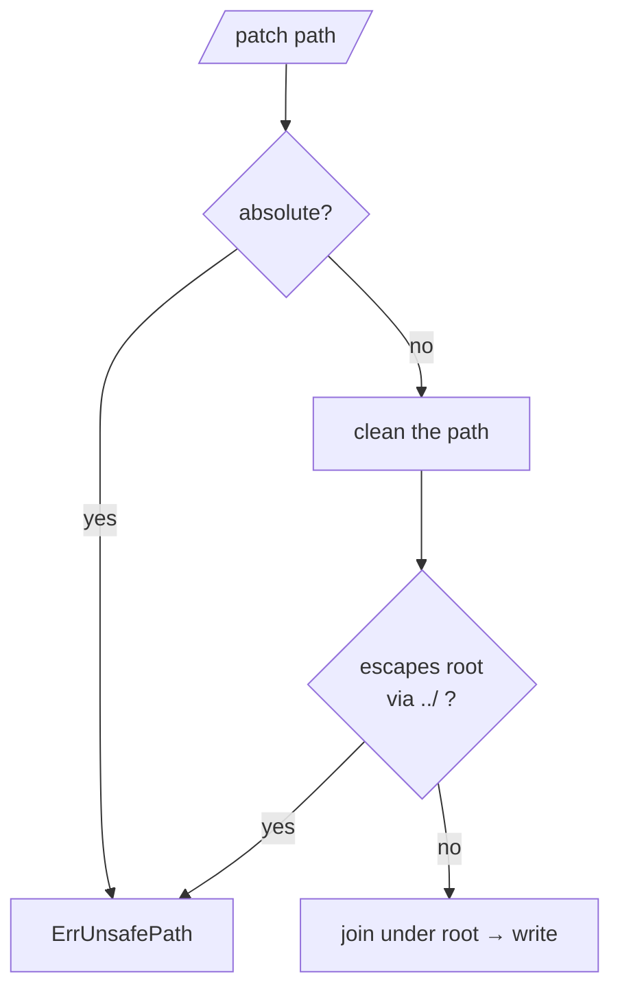

# Filesystems & Safety

Apply runs against an `FS`, not the OS directly. That indirection is what lets
patchapply confine writes, apply in memory, and target anything tree-shaped.

```go
type FS interface {
	ReadFile(name string) ([]byte, error)
	WriteFile(name string, data []byte, perm fs.FileMode) error
	Remove(name string) error
	Exists(name string) bool
}
```

`ReadFile` must report a not-exist error (`fs.ErrNotExist` / `os.IsNotExist`)
for absent files so patchapply can tell `ErrMissing` from a real I/O failure.

## DirFS — confined to a directory

```go
fsys := patchapply.NewDirFS("/path/to/repo")
```

Every path in the patch is resolved **inside** the root. A path that climbs out
fails before anything is touched:



```go
// All of these fail with ErrUnsafePath; none touches the filesystem:
//   ../../etc/passwd
//   /etc/passwd
//   sub/../../escape
```

`DirFS` also creates parent directories on write and applies the patch's file
mode (`100644` → `0644`) when present, defaulting to `0644`.

> [!WARNING]
> `DirFS` is the boundary. If you implement `FS` yourself, **you** own
> path-safety — sanitize before opening anything, because patch paths are
> attacker-controlled strings.

## MemFS — apply in memory

```go
fsys := patchapply.NewMemFS(map[string][]byte{
	"a.txt": []byte("one\n"),
})

patchapply.ApplyDiff(fsys, diff, nil)

out, _ := fsys.ReadFile("a.txt")
all := fsys.Files() // snapshot of everything, keyed by clean path
```

Good for tests, previews, and pipelines where the result never needs to hit
disk.

## Your own FS

Implement the four methods to apply patches against a git object store, a
zip/tar tree, an overlay, or a remote store. patchapply only ever calls those
methods — it never reaches for `os` behind your back.
