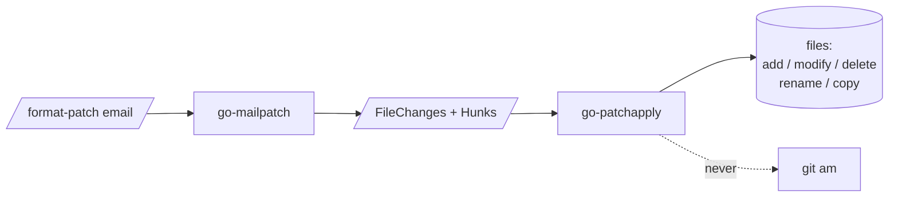

# go-patchapply

`go-patchapply` applies parsed patches to files. It is the **apply** half of
[go-mailpatch](https://github.com/floatpane/go-mailpatch):

mailpatch turns a `git format-patch` email into structured `FileChange`s;
patchapply writes those changes to a filesystem. It can also apply a bare
unified diff, reverse a patch, and dry-run one. **It never executes git** and
never creates commits — it only edits files.

It grew out of [matcha](https://github.com/floatpane/matcha)'s `git-mail`
feature, where applying a mailed patch has to be safe against hostile paths and
must never leave a half-applied tree.

## Why a separate library

Applying a diff *looks* trivial and is full of sharp edges:

- **Hunks drift.** The line a hunk targets has usually moved by the time you
  apply it. patchapply matches context and tolerates whole-hunk offset.
- **Half-applied trees are worse than none.** patchapply computes every change
  in memory first and writes only if *all* hunks place cleanly.
- **Paths are attacker-controlled.** `../../etc/cron.d/x` is just a string in a
  diff. `DirFS` confines every write to a root.

## What it handles

- **All change types** — added, deleted, modified, renamed, copied.
- **Offset-tolerant application** with exact context matching (no silent fuzz).
- **Reverse** (unapply) and **dry-run** (validate, write nothing).
- **Pluggable targets** — the real filesystem (`DirFS`), memory (`MemFS`), or
  your own `FS`.

## What it is not

- **Not a merge tool.** A hunk that doesn't apply is an `ErrConflict`, not a
  `<<<<<<<` marker.
- **Not `git am`.** No commits, no HEAD, no index — just files.
- **Not fuzzy.** It moves a hunk up or down to find its context; it will not
  apply against *changed* context. Failing loudly beats patching the wrong
  place silently.

## Sister projects

| Project | Role |
|---------|------|
| [floatpane/go-mailpatch](https://github.com/floatpane/go-mailpatch) | The parser half — produces the `FileChange`s applied here. |
| [floatpane/matcha](https://github.com/floatpane/matcha) | Reference consumer — `git-mail` patch apply. |
| [floatpane/go-secretbox](https://github.com/floatpane/go-secretbox) | Sibling extraction — password-based encryption for data at rest. |

> [!NOTE]
> The import path is `github.com/floatpane/go-patchapply` and the package name
> is `patchapply`.
