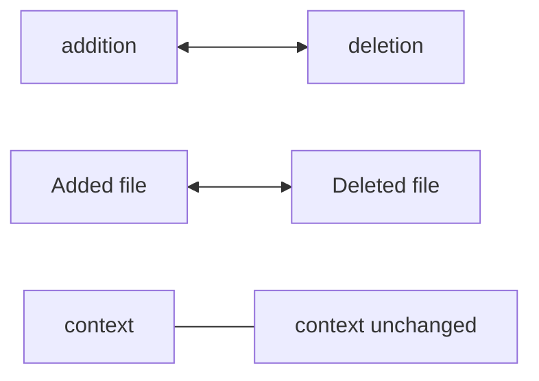

# Reverse & Dry Run

Both are flags on `Options`:

```go
type Options struct {
	Reverse bool // undo the patch instead of applying it
	DryRun  bool // validate everything, write nothing
}
```

## Dry run

A dry run does all of phase 1 — reads every target and places every hunk in
memory — then stops before writing. A `nil` error means a real apply would
succeed; the `Result` describes what *would* happen.

```go
res, err := patchapply.Apply(fsys, files, &patchapply.Options{DryRun: true})
if err != nil {
	log.Fatal("won't apply cleanly:", err) // ErrConflict, ErrMissing, ...
}
for _, f := range res.Files {
	fmt.Printf("would %s %s\n", f.Status, f.Path)
}
```

Use it to check a mailed patch against a working tree before committing to it,
or to show the user a preview.

## Reverse

`Reverse` inverts each change before applying, so applying with `Reverse: true`
undoes the same patch:



- additions become deletions and vice versa;
- a hunk's old/new line ranges swap;
- `Added` ↔ `Deleted`; a `Renamed`'s paths swap; undoing a `Copied` removes the
  copy.

```go
// Apply, then roll back.
patchapply.Apply(fsys, files, nil)
patchapply.Apply(fsys, files, &patchapply.Options{Reverse: true})
// fsys is back to its original state.
```

Reverse + dry run compose: `Options{Reverse: true, DryRun: true}` checks whether
a patch *can* be cleanly rolled back without changing anything.

> [!NOTE]
> Reverse expects the tree to be in the patch's *post*-apply state, just as
> `git apply -R` does. Reversing a patch that was never applied will usually
> hit `ErrConflict`.
