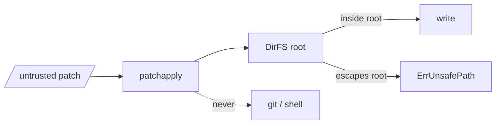

# Threat Model

patchapply **writes files** from patches that may be **untrusted** — a mailed
patch comes from whoever sent it. The patch's paths and contents are
attacker-controlled, so the security questions are about *where* it writes and
whether it can leave damage behind.

## What it defends

- **Path confinement.** `DirFS` rejects any path that is absolute or climbs out
  of its root via `../`, with `ErrUnsafePath`, **before** touching the
  filesystem. A patch cannot write outside the directory you handed it.

- **All-or-nothing writes.** Every hunk is placed in memory before anything is
  written. A patch that fails partway leaves the tree exactly as it was — no
  half-applied, inconsistent state for an attacker to exploit.
- **No silent misapplication.** Context must match exactly. patchapply will not
  drop context to force a hunk in somewhere plausible-but-wrong; it returns
  `ErrConflict` instead.
- **No git, no shell.** It never spawns a process. Nothing in a patch can turn
  into command execution here.

## What it does *not* do

- **It does not vet patch *content*.** It writes exactly what the diff says. If
  the diff inserts a backdoor into a file inside the root, patchapply will write
  that backdoor. Reviewing the change is the caller's job (parse with
  [go-mailpatch](https://github.com/floatpane/go-mailpatch), show it, gate on
  approval).
- **It does not follow or create symlinks specially.** If your root contains a
  symlink that points outside it, writing *through* that link can still escape.
  Apply into a directory you control, without hostile pre-existing symlinks.
- **It does not sandbox a custom `FS`.** Confinement is a property of `DirFS`.
  If you implement `FS` yourself, path-safety is yours to enforce.

> [!WARNING]
> Treat patch paths as hostile input. Prefer `DirFS` rooted at a directory you
> own. If you need to apply into a sensitive tree, dry-run first and review the
> `Result` paths before the real apply.

## Reporting

Found a path that escapes `DirFS`, an input that panics the applier, or a way
to leave a half-applied tree? Report it privately — see
[SECURITY.md](https://github.com/floatpane/go-patchapply/blob/master/SECURITY.md).
Please do not open a public issue for a vulnerability.
